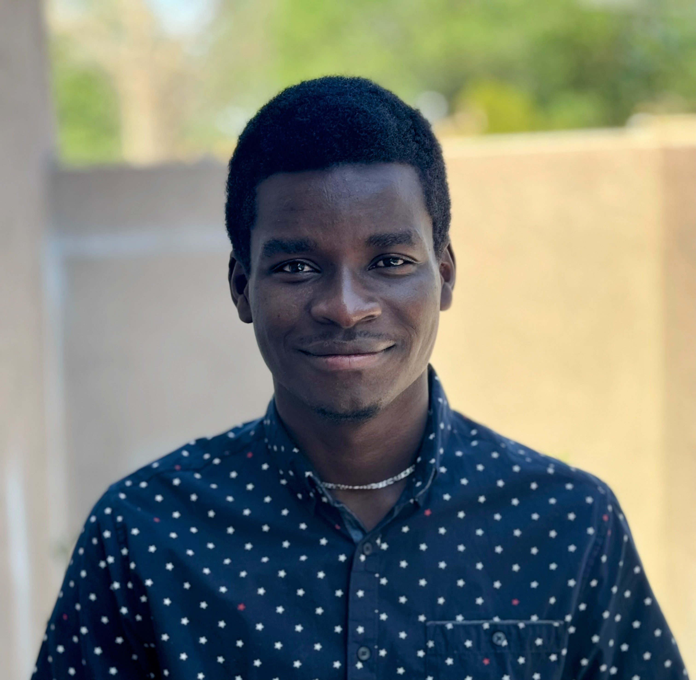
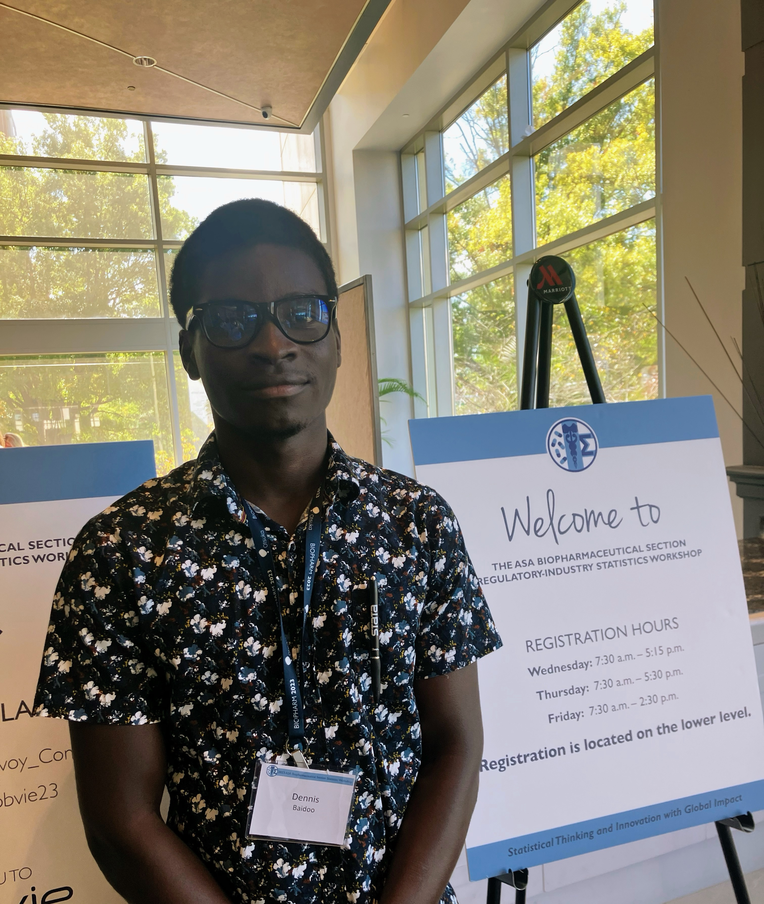

Dennis Baidoo, M.S, <a href="https://ww2.amstat.org/accreditation/roster.cfm" target="_blank">GStat</a>

Ph.D. Student in Biostatistics 
The Ohio State University

 baidoo.20@osu.edu 

 [Google Scholar](https://scholar.google.com/citations?user=ffB7SWYAAAAJ&hl=en&oi=ao) 

 [ResearchGate](https://www.researchgate.net/profile/Dennis-Baidoo-4/research) 

 [ORCiD](https://orcid.org/0009-0006-2719-7730) 

 [LinkedIn](https://www.linkedin.com/in/dennisbaidoo1)

## About Me

I am a Ph.D. student in Biostatistics at [The Ohio State University](https://www.osu.edu/), with a background in statistics, mathematics, and data-driven approaches to scientific research.

I earned my M.S. in Statistics from the [University of New Mexico](https://www.unm.edu/) and my B.Sc. double major in Mathematics and Statistics from the [University of Ghana](https://www.ug.edu.gh/). My academic journey reflects a commitment to applying statistical thinking and rigorous methodology to generate meaningful insights and support evidence-based decision-making.

*Outside of my research, I engage in professional service through ASA and ENAR initiatives, support underrepresented high school and college students, enjoy cooking authentic Ghanaian cuisine, participate in football, and pursue hands-on craftsmanship, including making leather sandals and building wooden furniture.*

Registration Assistant at the 2023 ASA Biopharmaceutical Section Regulatory-Industry Statistics Workshop, Rockville, MD

